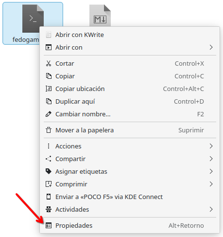
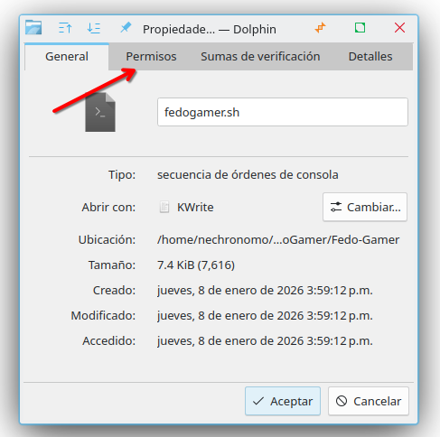
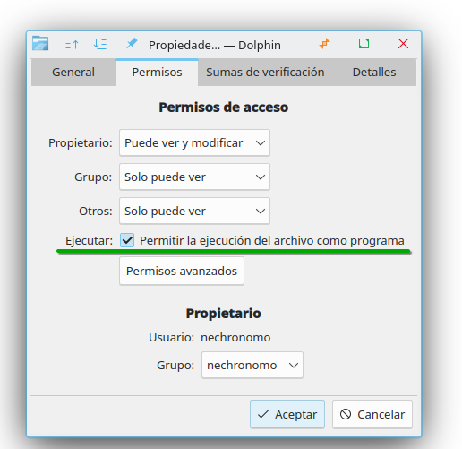
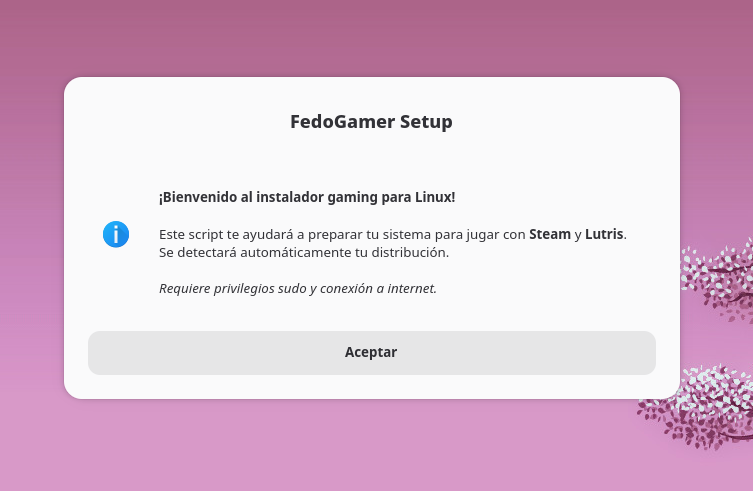

# FedoGamer

Este es un script realizado con la finalidad de facilitar el acceso de los que emigran de Windows a Linux buscando potenciar su experiencia de juego. 

La idea es mantener lo más simple posible el proceso de instalación mediante una interfaz gráfica y amigable con el usuario. 

Se aceptan ideas y sugerencias para mejorar este script. Cualquier comentario es bien recibido. 

¡GG! 

## Cómo usar

Descarga el archivo `fedogamer.sh` en tu equipo. 

### Dar permisos de ejecución:

**Click derecho sobre el archivo recién descargado y selecciona `Propiedades`**

**Ve a la pestaña `Permisos`**

**Selecciona `Permitir la ejecución del archivo como programa`**

(En Terminal: `chmod + x fedogamer.sh`)

### Ejecución

Dar `Doble Click` sobre `fedogamer.sh`. Sigue las instrucciones para instalar lo necesario

